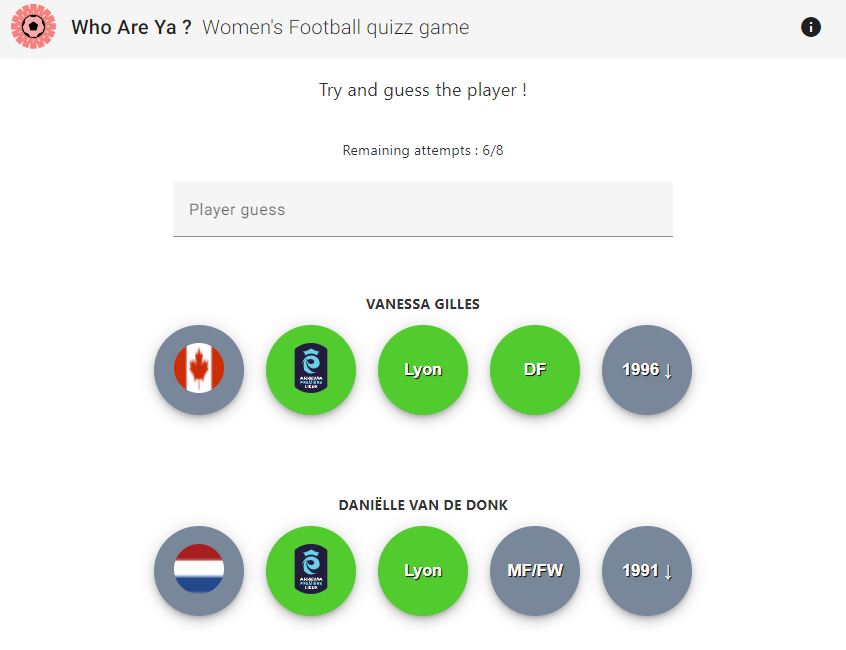

# Who Are Ya - Women's Football quizz game 

This project is an attempt to replicate  the footballer guessing game 'Who Are Ya?' (https://playfootball.games/who-are-ya/) for Women's football, while showing how Docker can be a solution for implementing a simple client-server architecture.



## Requirements
* Docker **v1.27.0** or newer (or Docker Desktop)
* Ensure your (localhost) ports **8000** and **4200** are not in use 

## Quick start

### Clone this repository and go to its root
```bash
git clone <repo> 
cd who-are-ya/
```
### Launch app

```bash
docker compose up -d --build
```
This command uses `-d` to run the containers in the background.

App should now be running on http://localhost:4200.

### Stop app

```bash
docker compose down
```
